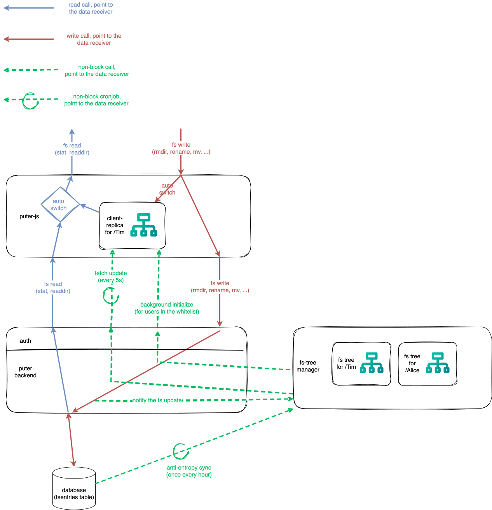

- Feature Name: Client Replica Filesystem
- Status: Draft
- Date: 2025-08-21

## Summary

**Client Replica Filesystem** is a mechanism that keeps a full copy of a user’s file metadata on the client and regularly syncs updates from the server. This feature allows:

* Rapid file system operations for read-only APIs such as `stat`, `readdir`, and `search`.
* Lower network I/O along with reduced database and CPU load on the server.

## Motivation

The *puter filesystem* is a critical component of Puter, it provides a POSIX-like filesystem interface to `puter-js` and powers the filesystem operations in the GUI web client. APIs provided by the filesystem include:

- Read-only APIs: `stat`, `readdir`, `search`.
- Write APIs: `mkdir`, `write`, `copy`, `move`, `rename`, `delete`, etc.

Currently, all of these operations are handled through the synchronous HTTP API and suffer from latency issues caused by network round trips and database index contention. For example, when a user opens a folder in the GUI web client, the request will go all the way to database to find what's inside the folder. There are 20 million filesystem entries in the database and the latency will keep increasing as the number of files grows.

To tackle this issue, we propose maintaining a **full replica** of the filesystem rooted at the user’s home directory on the client (e.g., for user Tim, all filesystem nodes under `/Tim` are stored locally). This allows users to perform read-only operations on the client replica without waiting for a server response. Updates to the filesystem will be fetched from the server periodically.



## Proposal

### Data Structure

**Merkel Tree** can be used to check the equality of two file system trees instantly and synchronize two trees by only sending the differences.

> A Merkle tree is a hash tree where leaves are hashes of the values of individual nodes. Parent nodes higher in the tree are hashes of their respective children. The principal advantage of Merkle tree is that each branch of the tree can be checked independently without requiring nodes to download the entire tree or the entire data set. Moreover, Merkle trees help in reducing the amount of data that needs to be transferred while checking for inconsistencies among replicas. For instance, if the hash values of the root of two trees are equal, then the values of the leaf nodes in the tree are equal and the nodes require no synchronization. If not, it implies that the values of some replicas are different. In such cases, the nodes may exchange the hash values of children and the process continues until it reaches the leaves of the trees, at which point the hosts can identify the nodes that are “out of sync”.

### Client-side Replica Filesystem

#### Initialization

The client will fetch all nodes under a user's home directory once the user is logged in by `puter.fs.replica_fetch(<path>)`. There are some details to consider:

- Client Memory Usage: In the POC implementation, a tree consists of 100K nodes takes around 10MB browser memory. A hard limit of 20MB (i.e., 200K nodes) can be set at server side to avoid taking too much memory. When a user has too much file nodes under his home directory, server can send an error back to the client.
- Initialization Time: According to the data size mentioned above, the initialization will finish within 1 second. But it's still great to put it in a background task to avoid blocking the UI thread.
- Permission: Permission check should be enforced on both client side and server side. A user can only fetch the tree started from his home directory. A simpler design is to remove the args from `puter.fs.fetch_tree` and make it "fetch all files for the current user".

#### File System Operations Upon Fetching

To make the system consistent, the local replica will work with all existing file system APIs except `read` and `write`. A simple implementation is to have a switch branch for local replica:

```js
const readdir = async function (...args) {
    ... (existing code)

    if (this.local_replica.available) {
        return this.local_replica.readdir(options.path);
    }

    ... (existing code which fetches from server)
}
```

#### Check for Changes

This is done via api `puter.fs.replica_check(<path>, <hash>)`, it return a true for changed and false for not changed.

### Synchronize Changes

Synchronize is done via HTTP endpoint `/api/fs/replica/sync`.

Here is an example of a complete cycle of sync:

A request from client to server is like:

```json
{
  "path": "/Tim",
  "children": [
    {
        "hash": <hash>,
        "name": "same",
        "last_updated": "2025-01-01T05:00:00Z",
    },
    {
        "hash": <hash>,
        "name": "client_newer",
        "last_updated": "2025-01-01T05:00:00Z",
    },
    {
        "hash": <hash>,
        "name": "server_newer",
        "last_updated": "2025-01-01T05:00:00Z",
    },
    {
        "hash": <hash>,
        "name": "client_only",
        "last_updated": "2025-01-01T05:00:00Z",
    }
  ]
}
```

Then the server compares this tree with its own replica:

```json
{
  "path": "/Tim",
  "children": [
    {
        "hash": <hash>,
        "name": "same",
        "last_updated": "2025-01-01T05:00:00Z",
    },
    {
        "hash": <hash>,
        "name": "client_newer",
        "last_updated": "2025-01-01T04:00:00Z",
    },
    {
        "hash": <hash>,
        "name": "server_newer",
        "last_updated": "2025-01-01T06:00:00Z",
    },
    {
        "hash": <hash>,
        "name": "server_only",
        "last_updated": "2025-01-01T06:00:00Z",
    }
  ]
}
```

The server found the following changes:

- `/Tim/same` is the same on both client and server.
- `/Tim/client_newer` is newer on client than server.
- `/Tim/server_newer` is newer on server than client.
- `/Tim/client_only` is absent from the server replica.
- `/Tim/server_only` is absent from the client replica.

The server will send the following response to the client:

```json
{
    "pull_requests": [
        {
            "path": "/Tim/client_newer",
        },
        {
            "path": "/Tim/client_only",
        }
    ],
    "push_requests": [
        {
            "path": "/Tim/server_newer",
            "last_updated": "2025-01-01T06:00:00Z",
            "metadata": {
                "uuid": <uuid>,
                "is_dir": <is_dir>,
                ...
            },
            "children": [
                {
                    "hash": <hash>,
                    "name": "child_1",
                    "last_updated": "2025-01-01T06:00:00Z",
                },
                ...
            ]
        },
        {
            "path": "/Tim/server_only",
            "last_updated": "2025-01-01T06:00:00Z",
            "metadata": {
                "uuid": <uuid>,
                "is_dir": <is_dir>,
                ...
            },
            "children": [
                {
                    "hash": <hash>,
                    "name": "child_1",
                    "last_updated": "2025-01-01T06:00:00Z",
                },
                ...
            ]
        }
    ]
}
```

Now the client get 2 parts of changes to sync:

- `pull_requests`: A pull request from server for content that are newer on client.
- `push_requests`: A push request from server for content that are newer on server.

It will do the same action as the server and send something back. This communication well continue until all changes are synced.

#### Logic for `pull_requests`

`pull_requests` means "From the previous message, I know some nodes are newer on your side, please send them over".

- Q: Why only the node path is sent?

  A: Because we are asking for new content, so the path is enough. More specifically, `hash` and `last_updated` are already received and compared.
- Q: What if the content in `pull_requests` is missing in the peer's replica? For instance, we ask for `/Tim/client_newer` but it's deleted when the `pull_requests` arrives.

  A: Then the peer should just ignore it.

#### Logic for `push_requests`

`push_requests` means "From the previous message, some nodes **probably** are newer on my side, here are their details".

- Q: What if the peer updated the content and receives a push request with obsolete content?

  A: That's when `last_updated` kicks in, the peer will just check `last_updated` and drop the push request.
- Q: Why a node's immediate children are included in `push_requests`?

  A: So the peer can fetch the children that he interested in. For instance, the peer receives children `[a, b, c]` from the push request and find `a` is missing while `b` is obsolete. Then he send `[a, b]` in the next pull request.
- Q: What if we only send the node itself in the `pull_requests`?

  A: Then we need extra api to fetch a node's children. No matter what, we need to exchange information about "what's inside this subtree?".
- Q: What if we send all descendants at once in the `pull_requests`?

  A: It still works. The good thing is we no longer to send further pull requests - all descendants are already there. The bad thing is we lost the **partial sync** trait.

#### Details and Considerations

- `last_updated` here is **not the last modified time** of this node, but the last updated time of the tree started from this node. i.e., a change to a node's metadata will trigger update of `hash` and `last_updated` on all its ancestors.
- Q: Why introduce `last_updated` here, can we just use `last_modified` or remove this field?

  A: The sole function of `last_updated` is **confliction resolution**. If a server/client accepts changes from peer unconditionally, we don't need `last_updated`.
- Q: How `hash` is calculated?

  A: By hashing a node's metadata and all its immediate children's `hash`.
- Q: Which fields are included in `hash`?

  A: All fields that are used by `puter.fs.stat` should be included. Fields such as `bucket`, `file_request_token` are not included. See: [full fields list](https://github.com/HeyPuter/puter/blob/8e58fabb7156d02c0e396ad26788e25ab0138db8/src/backend/src/services/database/sqlite_setup/0001_create-tables.sql#L70-L99)
- Q: Why use full path for each item in `pull/push_requests` instead of add a top-level `path` field?

  A: TODO (add a comparison table here)

### Server-side Replica Filesystem

#### Workload

- 20M nodes as of 2025-08-21, we expect it can hold 100M nodes with decent performance.
- 1M changes per day to the whole filesystem.
- Most user has less than 10K nodes under his home directory.

According to experiment, the initialization of a 500K nodes tree takes around 150 seconds under node.js environment. And the initialization will block all other actions because of node.js's single-threaded event loop model.

We can expect the initialization of 100M nodes tree takes around 10 hours using the naive implementation. And the result tree takes 100M * 1KB = 100GB memory/disk. This gives up some requirement on the initialization and storage:

- The whole Merkel tree should be persisted since the initialization is too slow.
- The design of the processing model should be based on the storage model.
- `fsentries` table will be the "source of truth" for the filesystem in a long time, we need to design the storage model based on it.

#### Draft

I'd like to split the server-side replica into 3 parts:

- initializer: who is responsible for the initialization of the tree.
- tree maintainer: who is responsible for the continuous maintenance of the tree.
- storage: who is responsible for the storage of the tree.

We will forget about the router for now. I.e., we don't care about who is responsible for communicate with the client.

There is another issue: now there are 2 write paths, one if from replica sync and another is from existing `/write` api.

#### Storage

Here we propose following approaches in `<runner> + <storage>` format

**Tree Maintainance Process + Redis**

In intialization phase, the "tree maintainance process" load all fs nodes from database and generate the merkel tree, then store the tree in redis where key is the full path of a node and value is `[merkle_hash, uuid, last_updated]`.

Example:

```json
{
    "key": "/Tim/a",
    "value": {
      "merkle_hash": "1234567890",
      "uuid": "1234567890",
      "last_updated": "2025-01-01T05:00:00Z"
    }
}
```

One tricky issue is to deal with the changes happen during the initialization. The naive solution is stopping provide service to public in this phase. Another solution is receive fs updates from puter backend and put them in a backlog queue, then consume the queue once the initialization is completed.

**Tree Maintainance Process + In Progress Memory**

Same as the previous approach, the only difference is store the merkel tree in memory instead of redis.

This approache is worse than the previous one since we lost redis' built-in persistence feature.

**Tree Maintainance Process + `fsentries` table**

TODO

**Puter backend + `fsentries` table**

TODO

#### Initialization

### Anomalies - Clock Skew
